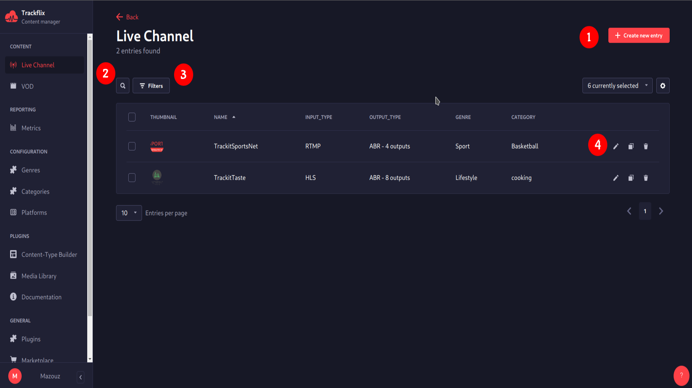
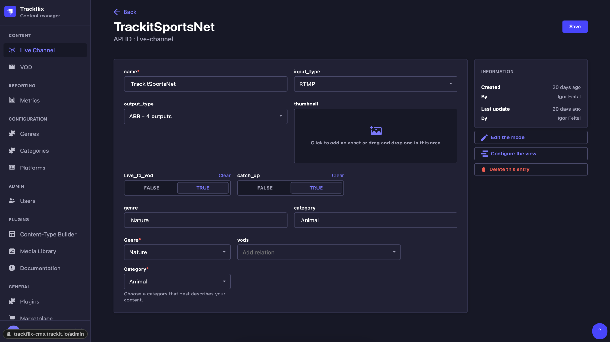

# Live Channel
Live Channel

## (1) Create new entry
Create easly a new Live Channel. Upon clicking, a pop-up will emerge, letting you the ability to choose the input type, name, thumbnail, output type, and associate it with a genre and category. Save it and your 
## (2) Search
Here you have the search section where you can search for a specific live channel
## (3) Filters

You can setup some filters to find the live channel that you are looking for faster.

## (4) Edit

Customize your Live Channel: Modify the channel name, input and output formats, thumbnail, genre, and category. Additionally, you have the ability to configure settings such as enabling live-to-VOD or catch-up options.