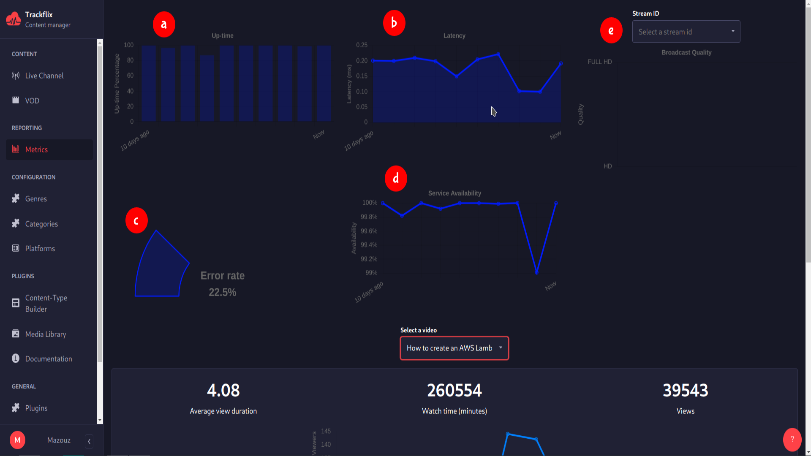
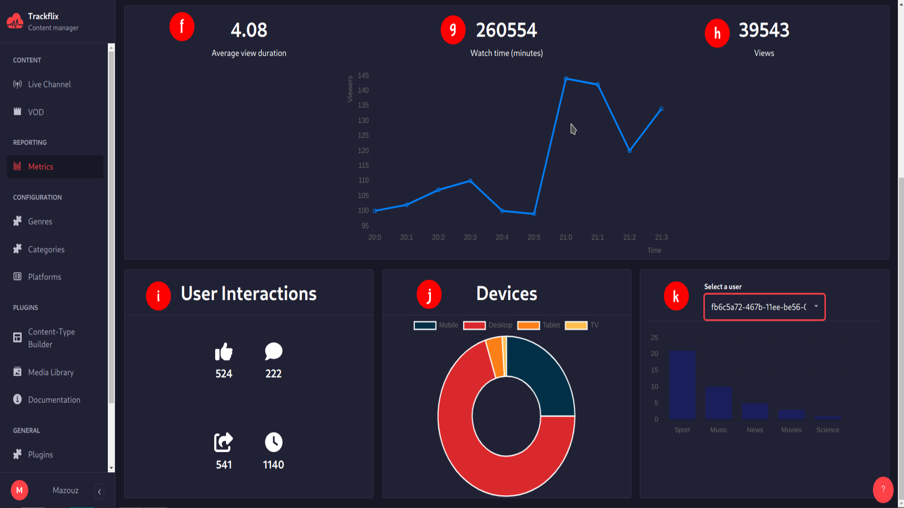

# Metrics
Metrics

The metrics section is designed to provide valuable insights into your user base and contribute to the overall prosperity of your platform. Below, you will find a breakdown of the available metrics and their respective benefits
## (a) Up-time : 
This measures the time the broadcasting service is available without interruption. Higher up-time indicates more reliable service, leading to better viewer satisfaction.
## (b) Latency
It indicates the delay before data starts transferring. Lower latency means less delay in receiving the broadcast, crucial for live events.
## (c) Error rate:
This measures the frequency of errors, such as transmission errors or downtime. Lower error rates can lead to a more reliable viewing experience, reducing frustration caused by interruptions or glitches.
## (d) Service Availability
This refers to the ability of viewers to access the service when they want to. High service availability can improve viewer satisfaction and loyalty.
## (e) Broadcast Quality
Metrics such as bit rate, resolution, and frame rate can be deployed to evaluate the caliber of broadcasts. Superior broadcast quality can enrich the viewing experience.
## (f) Average view duration
It’s the average amount of time viewers spend watching a particular live or VOD. 
## (g) Watch Time
It’s the total amount of time a specific viewer spend watching a particular live or VOD.
## (h) Views
The views metrics shows how many time a particular video or broadcast has been watched.
## (i) User Interaction
User interaction show data related to how viewers engage with contents
## (j) Devices
This metric tracks the devices and platforms viewers use to access content
## (k) User preferences
It refer to the specific choices, interest, and preferences of viewers when it comes to content