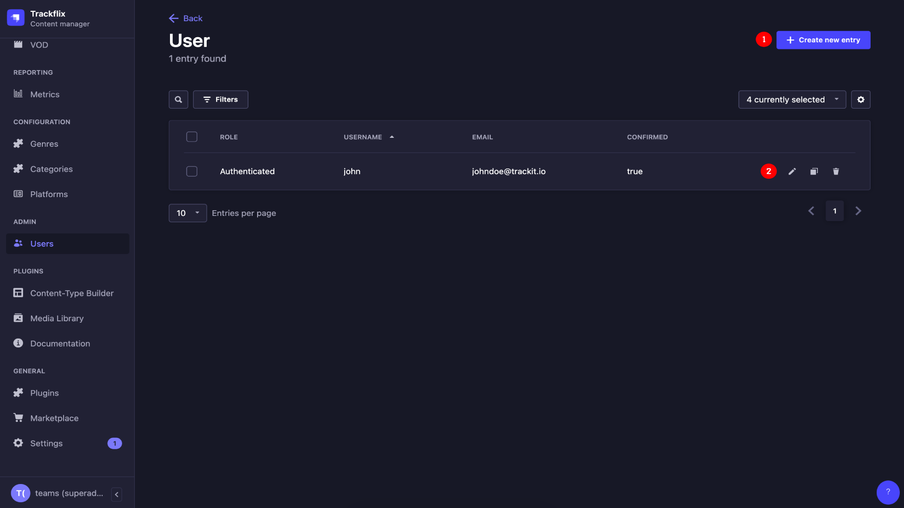
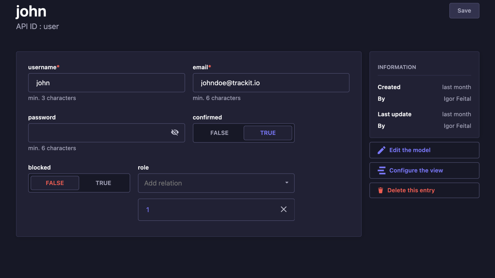

# User
User Documentation

The user management page enables you to effortlessly create a user and efficiently oversee their username, email, password, and, most notably, their role

## Edit
This button directs you to the page where you can easily edit a user's name, email, password, and role.

